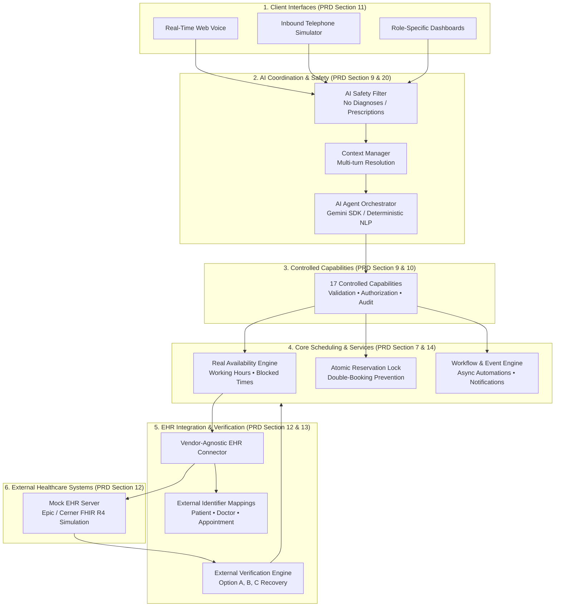
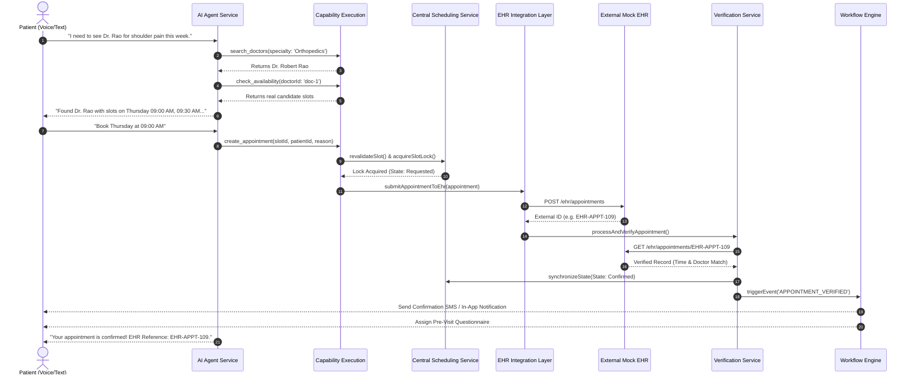
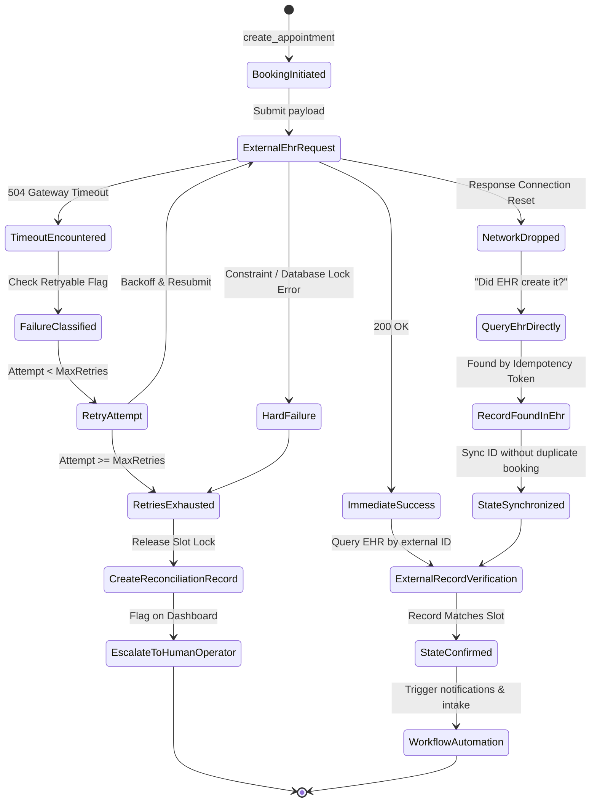

# OmniHealth AI: Architecture & System Design Documentation

This document describes the high-level architecture, domain model, booking sequence, EHR integration flow, failure recovery state machines, and security tenant model implemented in OmniHealth AI (PRD Sections 2, 8, 12, 13, 22, 23, 24).

---

## 1. High-Level Architecture

The platform enforces strict separation between client interfaces, AI coordination, controlled capabilities, scheduling core, integration layer, and external EHR systems:

---

## 2. Booking & Verification Sequence Flow

The core product principle dictates: **"Do not report success until the external result is verified against the external healthcare system."**

---

## 3. Failure Recovery State Machine (PRD Section 28)

---

## 4. Multi-Tenant Security & Isolation Model

Tenant boundaries are strictly mandatory (PRD Section 8 & 21):
- **Hospital A** cannot view, query, or modify **Hospital B's** private configuration, doctors, calendars, appointments, pre-visit questionnaire responses, or AI conversation context.
- All query operations in the database layer enforce strict tenant scoping via `hospitalId`.
- External credentials, mock EHR API keys, and voice secrets are isolated per tenant connection.
- Operational logs are privacy-aware and strip raw sensitive clinical narratives and PHI, maintaining auditability through anonymized correlation IDs.
